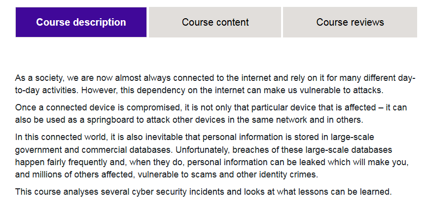
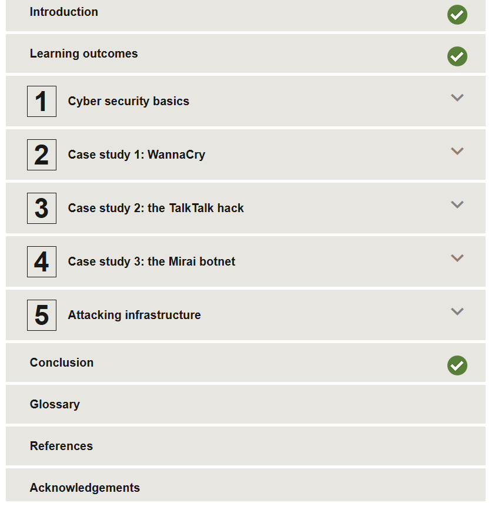
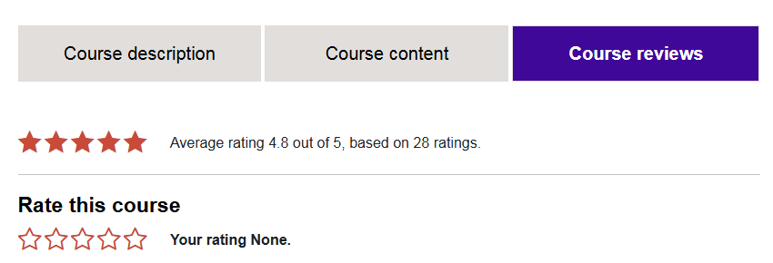

# 🛡️ Learning from Major Cyber Security Incidents (OpenLearn)

This repository contains **notes, labs, demos, guides, and certificate** for the *Learning from Major Cyber Security Incidents* program by OpenLearn. It covers **real-world cyber incidents, their analysis, mitigation strategies, and lessons learned** for both Red Team and Blue Team perspectives.

---

## 📚 Notes
- 📄 [01-introduction.md](./notes/01-introduction.md) – Introduction to cybersecurity incidents  
- 📄 [02-wannacry-ransomware.md](./notes/02-wannacry-ransomware.md) – WannaCry case study  
- 📄 [03-equifax-breach.md](./notes/03-equifax-breach.md) – Equifax breach case study  
- 📄 [04-solarwinds-attack.md](./notes/04-solarwinds-attack.md) – SolarWinds attack analysis  
- 📄 [05-colonial-pipeline.md](./notes/05-colonial-pipeline.md) – Colonial Pipeline ransomware  
- 📄 [06-notpetya-attack.md](./notes/06-notpetya-attack.md) – NotPetya wiper malware  
- 📄 [07-lessons-learned.md](./notes/07-lessons-learned.md) – Consolidated lessons learned  

---

## 🧪 Labs
- 📄 [01-wannacry-lab.md](./labs/01-wannacry-lab.md) – WannaCry simulation  
- 📄 [02-equifax-lab.md](./labs/02-equifax-lab.md) – Vulnerability assessment lab  
- 📄 [03-solarwinds-lab.md](./labs/03-solarwinds-lab.md) – Supply chain attack simulation  
- 📄 [04-colonial-pipeline-lab.md](./labs/04-colonial-pipeline-lab.md) – VPN & MFA lab  
- 📄 [05-notpetya-lab.md](./labs/05-notpetya-lab.md) – Malware analysis & backup restoration  

---

## 📝 Demo
- 📄 [demo-examples01.md](./demo/demo-examples01.md) – WannaCry attack flow demo  
- 📄 [demo-examples02.md](./demo/demo-examples02.md) – Equifax exploitation demo  
- 📄 [demo-examples03.md](./demo/demo-examples03.md) – Supply chain attack demo  

---

## 📋 Guides
- 📄 [incident-response-guidelines.md](./guides/incident-response-guidelines.md) – IR process and best practices  
- 📄 [setup-lab-environment.md](./guides/setup-lab-environment.md) – Lab environment setup  
- 📄 [threat-mitigation-strategies.md](./guides/threat-mitigation-strategies.md) – Defensive strategies  

---

## 📖 Docs
- 📄 [glossary.md](./docs/glossary.md) – Key terms & definitions  
- 📄 [index.md](./docs/index.md) – Course overview  
- 📄 [references.md](./docs/references.md) – References & further reading  
- 📄 [roadmap.md](./docs/roadmap.md) – Suggested learning path  
- 📄 [syllabus.md](./docs/syllabus.md) – Program syllabus  

---

## 📸 Screenshots

| Step | Screenshot |
|------|------------|
| Course Overview |  |
| Course Content |  |
| Course Reviews |  |

---

## 📜 Certificate
🎓 [Open Learn – Learning from Major Cyber Security Incidents](./cert/Open%20Learn%20Learning%20from%20major%20cyber%20security%20incidents.pdf)

---

## ✍️ Author
**Thành Danh** – Red Team Learner & Security Researcher  

- GitHub: [@ngvuthdanhh](https://github.com/ngvuthdanhh)  
- Email: ngvu.thdanh@gmail.com  

---

## 📄 License
This project is licensed under the **MIT License**. See [LICENSE](./LICENSE) for full details.  
© 2025 ngvuthdanhh. All rights reserved.
